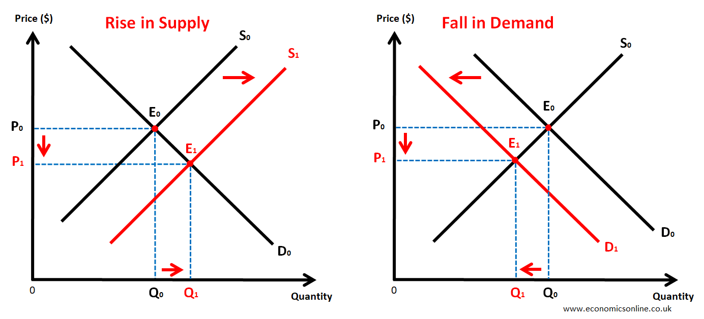

## Supply & Demand

---

## What is a Market?
- A **market** is any place where buyers and sellers meet to exchange goods and services.
- Key feature: **Voluntary exchange** — both buyer and seller agree willingly.
- Example:  
  - Buying strawberries for $3:  
    - Buyer values strawberries more than $3.  
    - Seller values $3 more than the strawberries.  
  - Both parties are better off.

- Voluntary exchange also applies in labor markets (e.g., cashier paid $10/hour).

---

## Why Markets Matter
- Markets allocate **scarce resources** efficiently.
- **Price signals** coordinate supply and demand:  
  - Too many strawberries → price falls → farmers produce less.  
  - Too few strawberries → price rises → farmers produce more.
- Market incentives promote **high-quality products**:  
  - Bad products lose customers and market share.
- If consumers dislike a company's practices, they can stop buying (market discipline).
- Free market spending signals what should be produced and how.

---

## Supply and Demand: The Basics

### Law of Demand
- When **price rises**, quantity demanded **falls**.  
- When **price falls**, quantity demanded **rises**.  
- Represented by a **downward sloping demand curve**.

### Law of Supply
- When **price rises**, quantity supplied **increases**.  
- When **price falls**, quantity supplied **decreases**.  
- Represented by an **upward sloping supply curve**.

---

## Market Equilibrium
- **Equilibrium price**: price where quantity demanded equals quantity supplied.
- **Surplus**: price too high, supply > demand → prices tend to fall.
- **Shortage**: price too low, demand > supply → prices tend to rise.

---

## Shifts in Supply and Demand
- Supply or demand curves can **shift** due to external factors.
- Example:  
  - Winter → harder to grow strawberries → supply curve shifts **left** (decreases supply).
- Four possible changes in a market:  
  1. Supply increases  
  2. Supply decreases  
  3. Demand increases  
  4. Demand decreases

---

## Price Fairness and Government Intervention
- Buyers prefer **lower prices**; sellers prefer **higher prices**.
- Prices emerge from voluntary exchange — economists avoid judging fairness.
- If demand falls, prices and quantities fall; farmers may ask for government help.
- Subsidies to failing markets can be **inefficient** (resources wasted on less valued goods).

---

## Real-World Example: Gasoline Market (2014)
- Gas prices fell over 40%.  
- Causes:  
  - Decreased demand (Europe and China economies slowed → demand left).  
  - Increased supply (fracking tech + restored production in Iraq/Libya → supply right).  
- Result: Prices dropped due to supply-demand shifts.

---

## Limits of Markets and Ethical Issues
- Markets work well for many goods but not all.  
- Example: Firefighters should not be a market commodity (emergency service).  
- Human organs market is controversial due to ethics and exploitation risks.  
- WHO warns payment for organs can exploit vulnerable groups and cause trafficking.  
- Some economists support regulated markets, e.g., **kidney exchanges** to increase donations.

---

## Summary
- Supply and demand are foundational to economics but not absolute laws like gravity.
- Economic behavior depends on human choices and preferences.
- Markets are efficient but sometimes require regulation or alternative approaches.

---

## Reflection
- How do voluntary exchange and price signals shape what you buy?  
- When should government intervene in markets?  
- What are ethical considerations in creating markets for sensitive goods?

---

