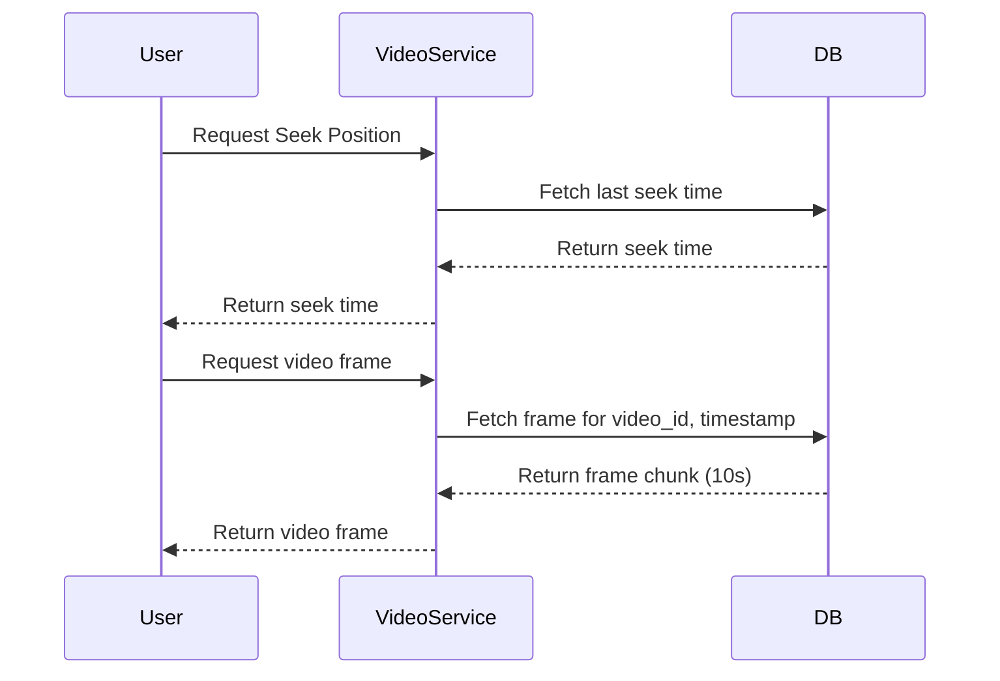

# 📘 System Design: Complete Revision & Interview Prep Notes

---

## 1️⃣ What is System Design?

- **Definition:** The process of defining the **architecture**, **components**, **data models**, and **interactions** of a large system to meet **business and technical requirements**.
- Focuses on **gluing the system together**, not code implementation.
- Core principles:
  - Scalability
  - Fault tolerance
  - High performance (latency & throughput)
  - Extensibility
  - Maintainability

---

## 2️⃣ Core Goals

- **Scalability**: Handle increased load via vertical/horizontal scaling.
- **Fault Tolerance**: Operate despite failures.
- **Performance**: Low latency, high throughput.
- **Extensibility**: Easily add features.
- **Maintainability**: Easy to debug and modify.

---

## 3️⃣ Fundamental Concepts

### Vertical Scaling

- Add CPU/RAM to a single machine (easy but hardware limits).

### Horizontal Scaling

- Add more servers to distribute load (distributed systems).

### Load Balancers

- Distribute traffic across servers with algorithms:
  - Round Robin, Least Connections, Least Response Time, IP Hashing, Weighted, Geo-based, Consistent Hashing.
- Add redundancy and failover.

### CDN (Content Delivery Network)

- Geo-distributed servers to reduce latency.
- Serve static content near the user.

### Caching

- Store frequently accessed data for faster retrieval:
  - Browser, server-side, database, CDN edge.
- Policies: LRU, LFU, FIFO.

### ⚡ Caching
Storing frequently accessed data in memory (like Redis, Memcached) to reduce load times.

### 🌍 IP Address
A unique identifier for a device on a network.

### TCP/IP
A suite of communication protocols used to interconnect network devices on the internet.

### DNS (Domain Name System)
Translates human-readable domain names (e.g. google.com) into IP addresses.

### HTTP (Hypertext Transfer Protocol)
A stateless protocol used for web communication.

### REST (Representational State Transfer)
An architecture style for building scalable web services using HTTP verbs (GET, POST, etc).

### GraphQL
A query language for APIs; allows clients to request exactly the data they need.

### gRPC
A high-performance, open-source RPC framework that uses HTTP/2 for transport.

### WebSockets
Provides full-duplex communication between client and server, ideal for real-time applications.

### Message Queues
Allow asynchronous communication between services (e.g., RabbitMQ, Kafka).
- Decouple producers and consumers.

### SQL
Relational database language used to manage structured data (tables, rows).

### ACID Properties
- **Atomicity:** All-or-nothing transactions
- **Consistency:** Always leaves DB in valid state
- **Isolation:** Transactions don’t interfere
- **Durability:** Results are permanent

### NoSQL
A set of non-relational database types: document, key-value, wide-column, graph.
- Good for scalability and unstructured data.

---

## 4️⃣ Data and Databases

### SQL Databases

- PostgreSQL, MySQL (ACID compliance).

### NoSQL Databases

- Redis, MongoDB, Cassandra, Neo4j (schema-less, scalable).

### In-Memory Databases

- Redis, Memcached for fast caching and sessions.

### Sharding

- Splitting data across servers (range-based, directory-based, geo-based).

### Replication

- Master-Slave and Master-Master for availability.

### Performance Techniques

- Caching, indexing, query optimization.

---

## 5️⃣ CAP Theorem

> You can only choose **2 of 3** at once.

- **Consistency** (all nodes see the same data)
- **Availability** (system always responds)
- **Partition Tolerance** (operates despite network issues)

---

## 6️⃣ Networking & Protocols

- **TCP:** Reliable, ordered.
- **UDP:** Fast, lossy.
- **HTTP:** Stateless request-response.
- **WebSockets:** Persistent two-way connection.
- **WebRTC:** Browser-based real-time.
- **gRPC:** HTTP/2-based RPC for microservices.
- **GraphQL:** Precise API data fetching.
- **MQTT, AMQP:** Lightweight async communication.
- **DNS:** Domain name resolution.

## Stateless vs Stateful

| Type       | Behavior                                                                 |
|------------|--------------------------------------------------------------------------|
| Stateless  | No memory of user/session; every request is complete                     |
| Stateful   | Tracks session/user; suitable for continuous media like live video       |

- **HTTP** = Stateless (simpler to scale)
- **WebRTC / HLS / MPEG-DASH** = Stateful (for video)

---

## 7️⃣ Real-World System Example: Live Streaming Playback Flow

> **Example:** Designing a system like **Twitch/Hotstar/Zoom** for live streaming.

### Playback Flow (Sequence Diagram Simplified)

### Core Flow:

1. User requests last watched position.
2. VideoService queries DB for seek timestamp.
3. User requests video frame.
4. VideoService fetches 10s frame chunk.
5. Frame streamed to the user for playback.

## Data Models (OOP + DB)

### `Video`
- `id`, `title`, `format`, `resolution`, `frames`, `metadata`
- Method: `getFrame(timestamp)`

### `User`
- `id`, `name`, `email`

### `WatchedVideo`
- `id`, `user_id`, `video_id`, `seek_timestamp`
- Method: `getSeekTime()`

## Storage Decisions

- **Videos** → S3, HDFS
- **Metadata (users, comments)** → SQL (PostgreSQL)
- **Realtime analytics / sessions** → Redis or NoSQL
- **Caching** → Redis/Memcached for last few minutes of video

## Use Case Diagram (Actors & Actions)

- **User**: watch video, comment, seek
- **Admin**: upload, tag, approve
- **Videographer**: create/upload raw footage

## Video Frame Delivery
- Clients fetch 10s chunks.
- Option 1: Client specifies start and end timestamps.
- Option 2: Client says “next 10s” — server infers from current pointer.
### Efficiency Tip
>Avoid duplicate video frame requests by letting server track state.

### Caching Optimization
- Preload next frame while one is playing
- Save seek timestamps per user to allow resume

## Protocols

| Use Case           | Protocol     | Reason                          |
|--------------------|--------------|----------------------------------|
| Comments           | HTTP         | Simple, reliable, stateless     |
| Live Streaming     | WebRTC       | Low latency, real-time          |
| Buffered Playback  | HLS / DASH   | Adaptive quality, resilience    |

Supporting components:

- Upload via RTMP.
- Segmentation into 10s chunks.
- Transcoding with MapReduce.
- Storage (S3, HDFS), Metadata (SQL/NoSQL).
- CDN distribution.
- Client playback frame-by-frame.

---

## 8️⃣ API Design Principles

- CRUD operations (POST, GET, PUT/PATCH, DELETE).
- REST (stateless), GraphQL (flexible), gRPC (efficient for microservices).
- Use JSON or Protocol Buffers.
- Version endpoints for backward compatibility.
- Rate limiting and pagination.
- Correct HTTP status codes.

**Example Endpoints:**

| Endpoint           | Method | Purpose               |
| ------------------ | ------ | --------------------- |
| `/get-video-frame` | GET    | Fetch 10s video frame |
| `/post-comment`    | POST   | Add comment           |
| `/seek-position`   | GET    | Get last watched time |

---

## 9️⃣ Production-Ready Architecture

- **CI/CD Pipelines:** Jenkins, GitHub Actions.
- **Load Balancers:** NGINX, AWS ELB.
- **Monitoring & Logging:** Sentry, Grafana, Loki.
- **Alerts:** Slack integration.
- **Debugging:** Always use staging environments.

---

## 🔟 Key Performance Metrics

- **Throughput:** Requests/queries per second.
- **Latency:** Response time per request.
- **Availability:** Uptime percentage.
- **SLOs (Service Level Objectives):** Internal goals ->  If an SLA guarantees 99.9% uptime, the SLO might be to achieve 99.95% uptime to provide a buffer. 
- **SLAs (Service Level Agreements):** Client commitments -> Uptime percentage, response time, error rates, resolution time. 

### 📈 Performance Considerations

- **Throughput vs Latency**
  - If optimizing for throughput → batch process frames (MapReduce)
  - If latency is critical → quick lookup and serve

- **Server Load Distribution**
  - Use load balancer + CDN
  - Stateless microservices → scale horizontally

- **Authentication**
  - Check user access rights before serving video frame
  - Optimize by embedding some auth at the video-service layer

---

## ✅ Final Engineering Practices

- Design for **scale and failure**.
- Prefer **stateless services**.
- Cache aggressively.
- Use **UML and sequence diagrams**.
- Modularize components.
- Apply **security best practices**.
- Measure, monitor, and log everything.
- Discuss **trade-offs** during interviews.
- Use **real-world examples**.
- Sketch **high-level architecture diagrams** to explain designs clearly.

---

Also check out these excellent resource:  
- [30 system design concepts](https://blog.algomaster.io/p/30-system-design-concepts)
- [Awesome System Design by Ashishps1](https://github.com/ashishps1/awesome-system-design-resources?tab=readme-ov-file)
